# A-Morphological-Post-Processing-Approach

# Notes

1. Run "Main.m" to see an example 
2. The code reads semantic segmentation mask (ex: "y1.png") and original image (ex: "yo.png") as the input from the data directory
3. Results directory contains a sample of U-Net segmentation masks, final instance segmentation results and Mask R-CNN outcomes with same test images.

# Sample of Results

<table align='center' style="padding:10px">
  <tr><th>Segmentation mask</th>  <th>Final segmentations</th></tr>
  
  <tr>
    <td></td>
    <td>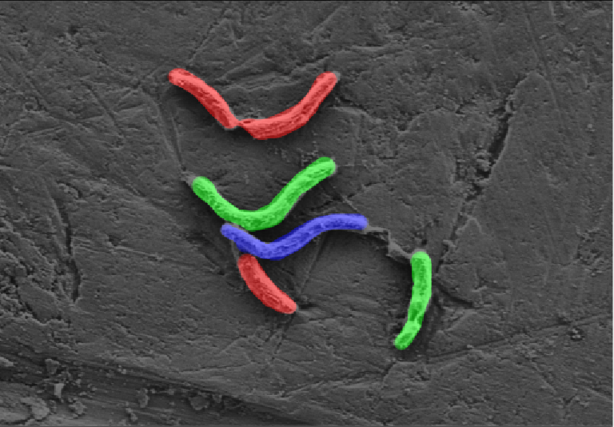</td>      
  </tr>

<tr>
    <td></td>
    <td>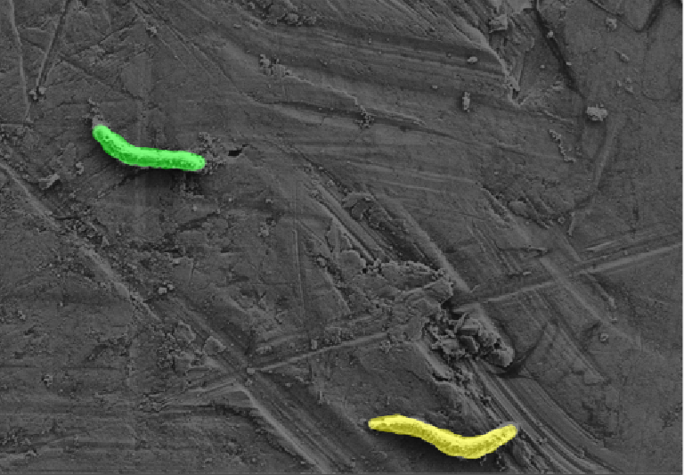</td>      
  </tr>	
	<tr>
    <td></td>
    <td>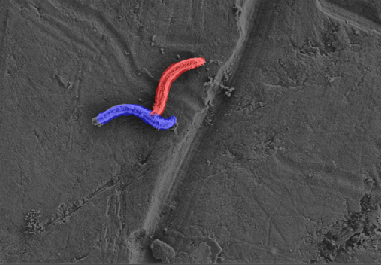</td>      
  </tr>	
<tr>
    <td></td>
    <td>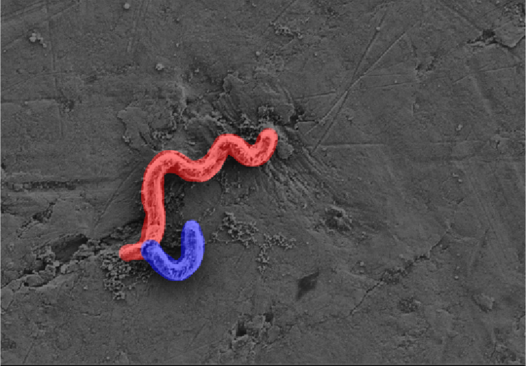</td>      
  </tr>	
<tr>
    <td></td>
    <td>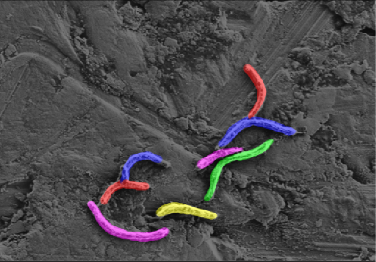</td>      
  </tr>	
<tr>
    <td></td>
    <td>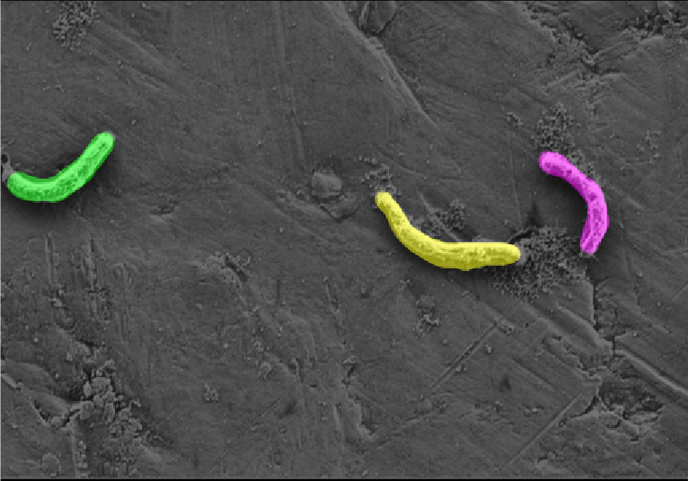</td>      
  </tr>	
	
<tr>
    <td></td>
    <td>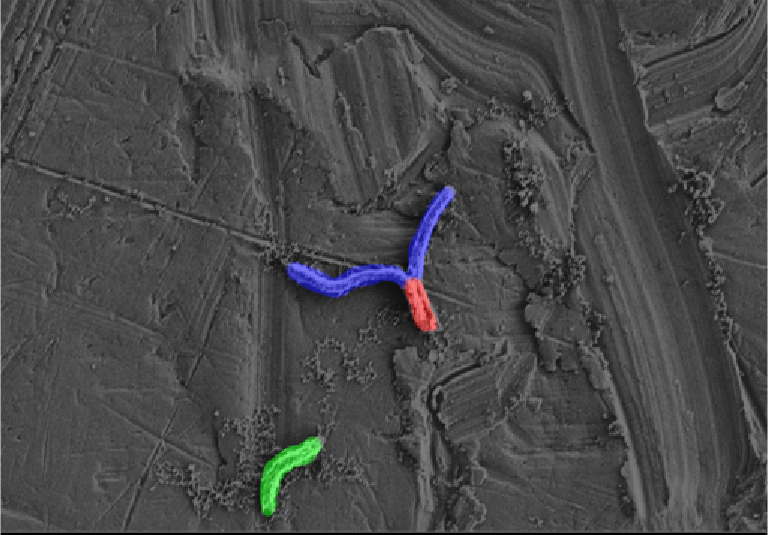</td>      
  </tr>	
	
<tr>
    <td></td>
    <td>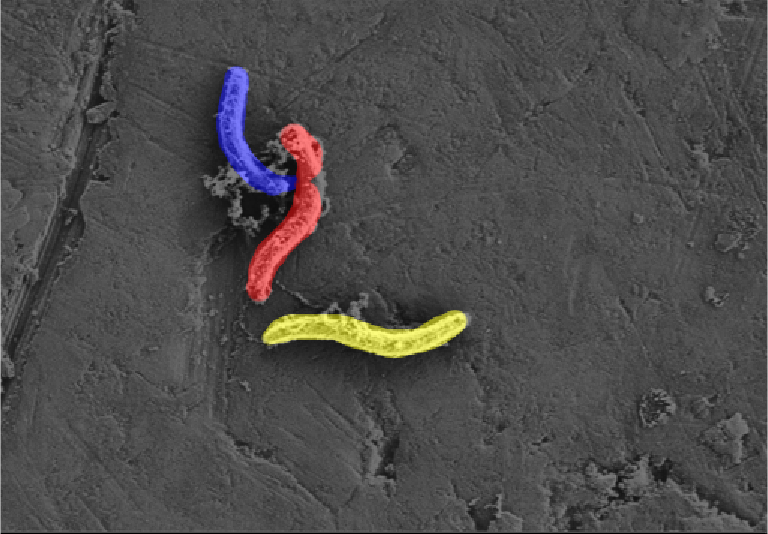</td>      
  </tr>	
	
<tr>
    <td></td>
    <td>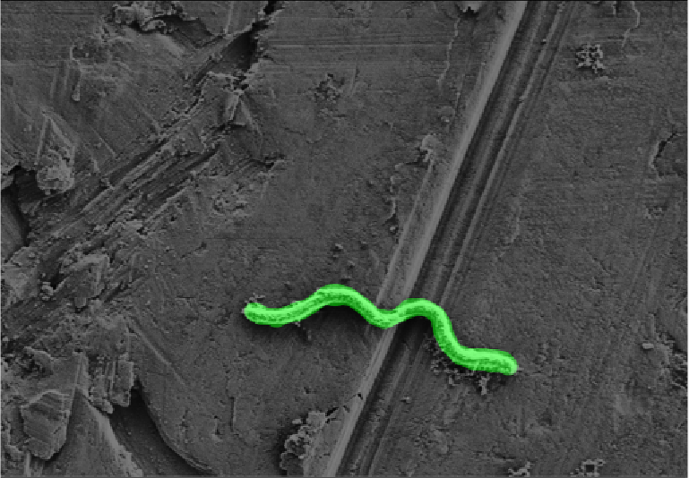</td>      
  </tr>	
<tr>
    <td></td>
    <td>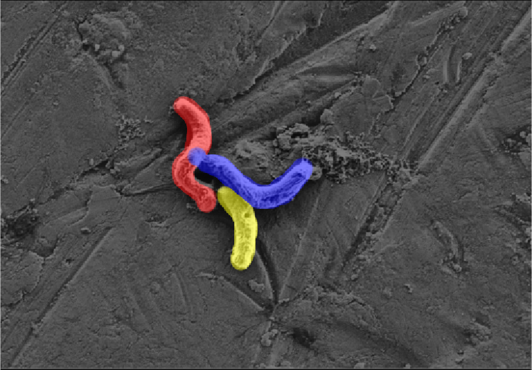</td>      
  </tr>	
<tr>
    <td></td>
    <td>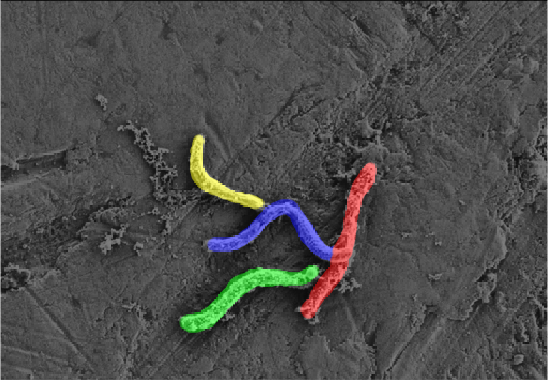</td>      
  </tr>	
</table>

## Mask R-CNN vs Ours

<table align='center' style="padding:10px">
  <tr><th>Mask R-CNN</th>  <th>Ours</th></tr>

  <tr>
		<td>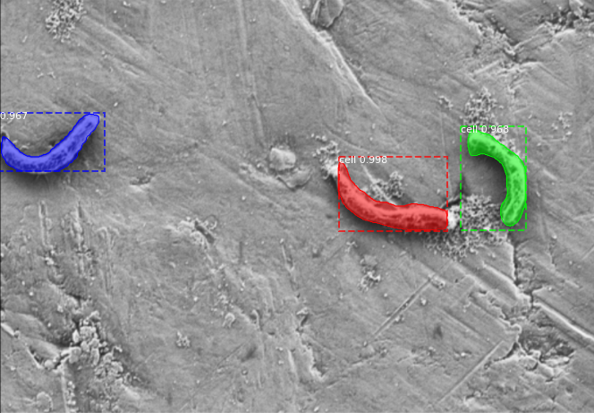</td>
		<td></td>      
  </tr>
  
  <tr>
	<td>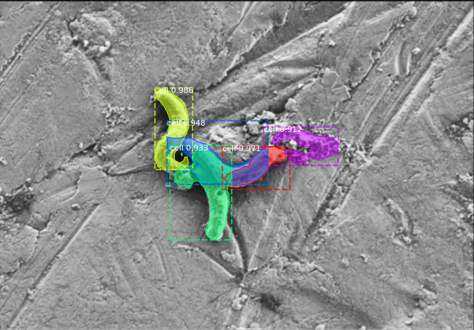</td>
	<td></td>      
  </tr>
	
 <tr>
	<td>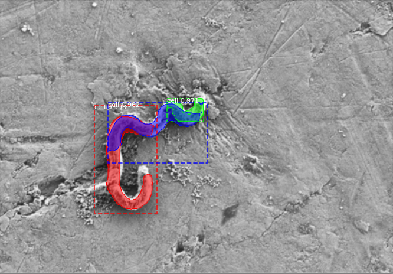</td>
	<td></td>      
  </tr>
	
<tr>
	<td>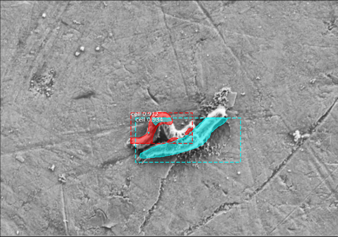</td>
	<td>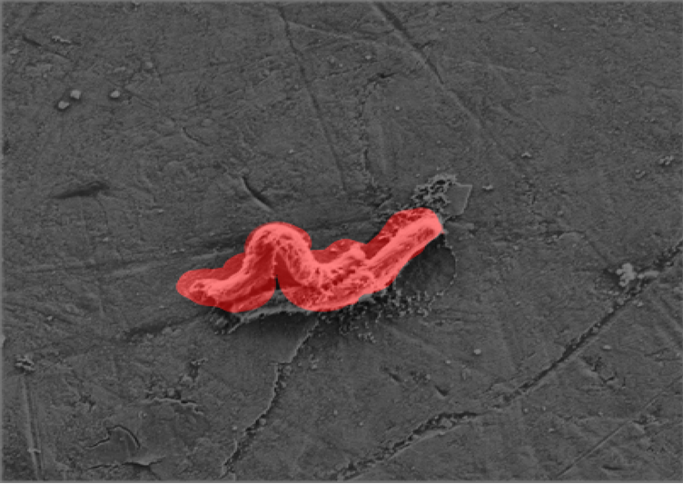</td>      
  </tr>
	
  
 </table>
 
 ## Execution Video examples
 
  ### Video with text comments within the videos for step-by-step in the run time
 
 
 
 
 ### Video with text comments within the videos
 
 
 
 
 ### Video 1
 

 ### Video 2
 

 ### Video 3
  

 ### Video 4
   

 

